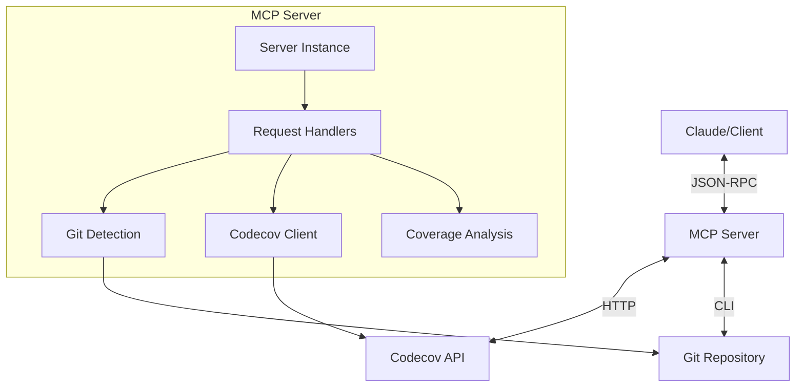

# Codecov MCP Server System Patterns

## Architecture Overview
The Codecov MCP Server is built as a Model Context Protocol (MCP) server that integrates with Codecov's API to provide tools for identifying files with low test coverage. The architecture follows a modular design with clear separation of concerns.



## Key Components

### 1. MCP Server Core
- **Server Instance**: Creates and manages the MCP server using the MCP SDK
- **Request Handlers**: Handles JSON-RPC requests for listing tools and calling tools
- **Error Handling**: Provides comprehensive error handling with appropriate error codes and messages

### 2. Git Repository Detection
- **Remote URL Parsing**: Extracts repository information from Git remote URLs
- **Format Support**: Handles both HTTPS and SSH remote URL formats
- **Service Detection**: Identifies the Git hosting service (GitHub, GitLab, Bitbucket)

### 3. Codecov API Integration
- **API Client**: Creates and manages the connection to Codecov's API
- **Authentication**: Handles authentication using API tokens
- **Data Retrieval**: Fetches coverage data for repositories

### 4. Coverage Analysis
- **File Filtering**: Filters files based on minimum line count and coverage threshold
- **Ranking**: Sorts files by coverage percentage to highlight the most critical areas
- **Statistics**: Calculates summary statistics like total files and average coverage

## Design Patterns

### 1. Dependency Injection
The server uses a form of dependency injection where components like the Codecov API client are created and passed to functions that need them. This approach improves testability and makes dependencies explicit.

```typescript
// Create Codecov API client
const client = createCodecovClient(token);

// Get coverage data using the client
const coverageData = await getCoverageData(client, service, owner, repo, depth);
```

### 2. Factory Pattern
The server uses factory functions to create instances of components like the Codecov API client. This pattern encapsulates the creation logic and provides a consistent interface.

```typescript
function createCodecovClient(token: string): AxiosInstance {
  const apiUrl = process.env.CODECOV_API_URL || "https://api.codecov.io/api/v2";
  return axios.create({
    baseURL: apiUrl,
    headers: {
      Authorization: `bearer ${token}`,
      Accept: "application/json",
    },
  });
}
```

### 3. Strategy Pattern
The server uses a strategy pattern for handling different types of requests. Each request type has a dedicated handler function that implements the appropriate strategy.

```typescript
server.setRequestHandler(ListToolsRequestSchema, async () => {
  // Strategy for listing tools
});

server.setRequestHandler(CallToolRequestSchema, async (request) => {
  // Strategy for calling tools
});
```

### 4. Adapter Pattern
The server acts as an adapter between the MCP protocol and the Codecov API. It translates MCP requests into Codecov API calls and transforms the responses back into the format expected by MCP clients.

### 5. Command Pattern
The `find_low_coverage_files` tool implements a command pattern, encapsulating a request as an object with parameters and executing the command to produce a result.

## Technical Decisions and Rationale

### 1. TypeScript
TypeScript was chosen for its strong typing system, which helps catch errors at compile time and provides better tooling support. It also offers good compatibility with JavaScript libraries and tools.

### 2. MCP SDK
The MCP SDK was used to simplify the implementation of the MCP protocol. It provides a consistent interface for handling JSON-RPC requests and responses, reducing the amount of boilerplate code needed.

### 3. Axios
Axios was chosen for HTTP requests due to its promise-based API, wide browser support, and features like request/response interception and automatic JSON transformation.

### 4. Child Process for Git
The `child_process` module was used to execute Git commands, allowing the server to detect repository information from the local Git configuration. This approach avoids the need for users to manually provide this information.

### 5. Error Handling
Comprehensive error handling was implemented to provide clear and actionable error messages. This includes specific error codes and detailed error messages that help users understand and resolve issues.

### 6. Logging
Detailed logging was implemented using `console.error` to provide visibility into the server's operation. This helps with debugging and monitoring, especially in production environments.

## Component Relationships

### Server and Handlers
The server instance manages the lifecycle of the MCP server and routes requests to the appropriate handlers. Handlers are registered with the server using the `setRequestHandler` method.

### Handlers and Services
Handlers use services like the Git detection and Codecov API client to fulfill requests. These services are created as needed and passed to functions that require them.

### Services and External Systems
Services interact with external systems like the Git repository and Codecov API. They handle the details of these interactions, such as authentication and data transformation.

## Data Flow

1. Client sends a JSON-RPC request to the MCP server
2. Server routes the request to the appropriate handler
3. Handler extracts parameters from the request
4. Handler creates and uses services as needed
5. Services interact with external systems
6. Handler processes the results and creates a response
7. Server sends the response back to the client

This architecture provides a clean separation of concerns, making the code easier to understand, test, and maintain.
